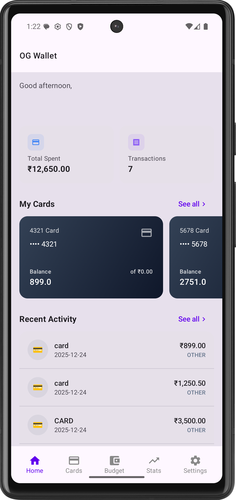
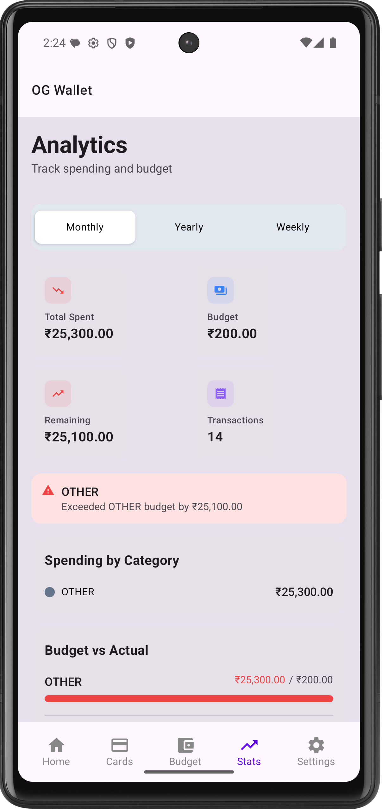
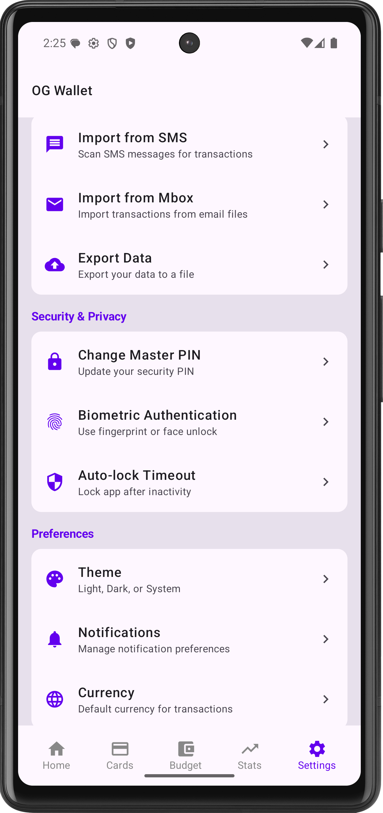
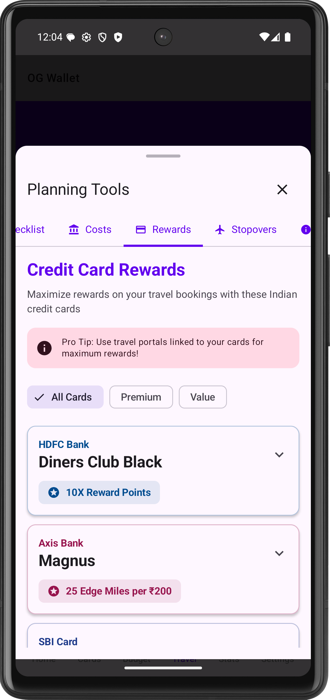
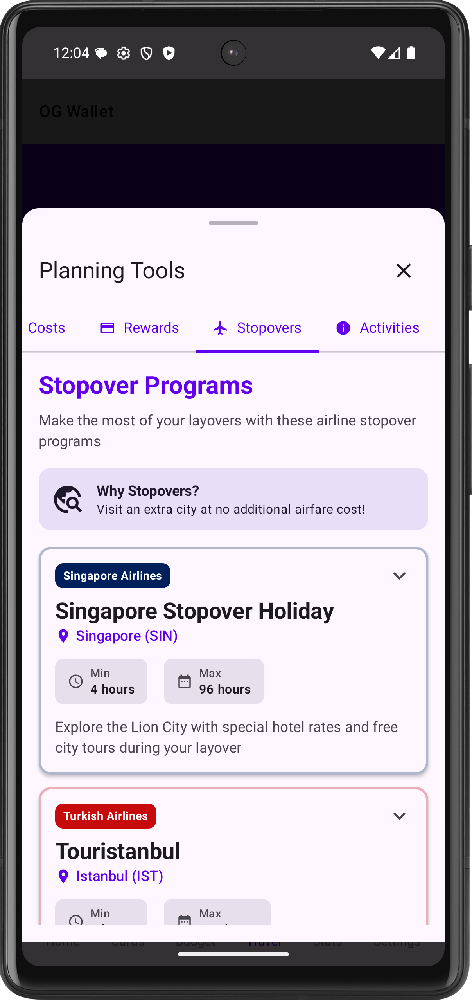
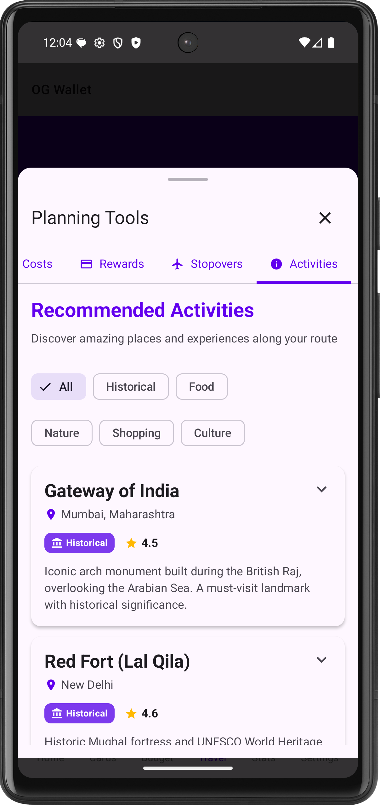
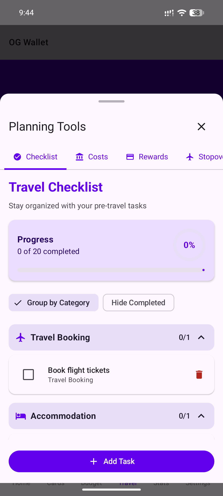
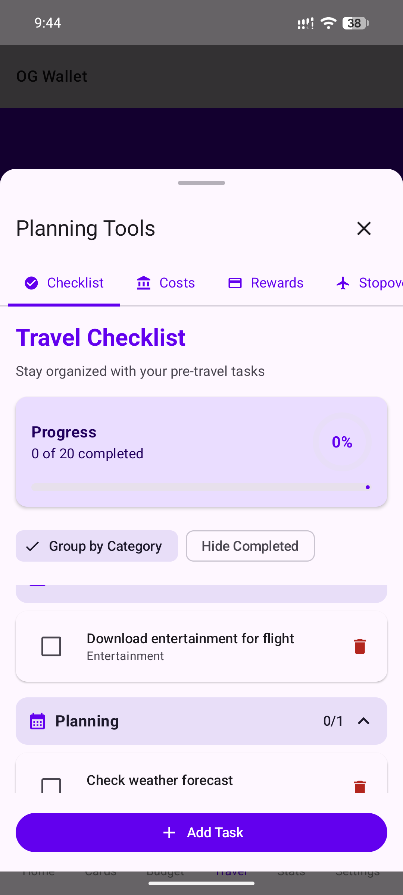

# OGWallet

<div align="center">
  
[](https://github.com/consumerfinance/ogwallet/releases/latest)
[](https://github.com/consumnerfinance/ogwallet/releases/)
[](https://github.com/consumnerfinance/ogwallet/stargazers)
[](./LICENCE)

</div>

<div align="center">
   
[](https://play.google.com/store/apps/details?id=dev.consumerfinance.ogwallet)
[](https://f-droid.org/app/dev.consumerfinance.ogwallet)
[](https://apps.obtainium.imranr.dev/redirect?r=obtainium://app/%7B%22id%22%3A%22dev.consumerfinance.ogwallet%22%2C%22url%22%3A%22https%3A%2F%2Fgithub.com%2Fconsumerfinance%2Fente%22%2C%22author%22%3A%22consumerfinance%22%2C%22name%22%3A%22OG%20Wallet%22%2C%22preferredApkIndex%22%3A0%2C%22additionalSettings%22%3A%22%7B%5C%22includePrereleases%5C%22%3Afalse%2C%5C%22fallbackToOlderReleases%5C%22%3Atrue%2C%5C%22filterReleaseTitlesByRegEx%5C%22%3A%5C%22%5C%22%2C%5C%22filterReleaseNotesByRegEx%5C%22%3A%5C%22%5C%22%2C%5C%22verifyLatestTag%5C%22%3Afalse%2C%5C%22dontSortReleasesList%5C%22%3Atrue%2C%5C%22useLatestAssetDateAsReleaseDate%5C%22%3Afalse%2C%5C%22releaseTitleAsVersion%5C%22%3Afalse%2C%5C%22trackOnly%5C%22%3Afalse%2C%5C%22versionExtractionRegEx%5C%22%3A%5C%22%5C%22%2C%5C%22matchGroupToUse%5C%22%3A%5C%22%5C%22%2C%5C%22versionDetection%5C%22%3Atrue%2C%5C%22releaseDateAsVersion%5C%22%3Afalse%2C%5C%22useVersionCodeAsOSVersion%5C%22%3Afalse%2C%5C%22apkFilterRegEx%5C%22%3A%5C%22econsumerfinance*%5C%22%2C%5C%22invertAPKFilter%5C%22%3Afalse%2C%5C%22autoApkFilterByArch%5C%22%3Atrue%2C%5C%22appName%5C%22%3A%5C%22%5C%22%2C%5C%22shizukuPretendToBeGooglePlay%5C%22%3Afalse%2C%5C%22allowInsecure%5C%22%3Afalse%2C%5C%22exemptFromBackgroundUpdates%5C%22%3Afalse%2C%5C%22skipUpdateNotifications%5C%22%3Afalse%2C%5C%22about%5C%22%3A%5C%22%5C%22%7D%22%2C%22overrideSource%22%3Anull%7D)
[](https://github.com/consumnerfinance/ogwallet/releases/)
[](https://consumerfinance.github.io/ogwallet)

</div>

<div>


  
</div>

This is a Kotlin Multiplatform project targeting Android, iOS, Web, Desktop (JVM).

## 🆕 Credit Card Data System

OGWallet now includes a complete system for crowdsourcing and displaying credit card offers and benefits!

### Features
- 📝 **Microsoft Forms Integration** - Collect offers from the community
- 🐍 **Python Processing Server** - Validate and process submissions
- 📦 **Git-based Data Storage** - Version-controlled JSON data
- 🎨 **Beautiful UI** - Display offers with gradients and emojis
- 🔄 **Automated Updates** - GitHub Actions for scheduled processing

### Quick Start

1. **Set up sample data:**
   ```bash
   cd data-server
   python3 test_setup.py
   ```

2. **Run the app:**
   ```bash
   ./gradlew :composeApp:run
   ```

3. **View offers:**
   Navigate to the "Offers & Rewards" screen to see credit card offers!

### Documentation
- 📖 [Complete Setup Guide](CREDIT_CARD_DATA_SETUP.md)
- 🚀 [Quick Start](data-server/SUMMARY.md)
- 📝 [Microsoft Forms Template](data-server/MICROSOFT_FORMS_TEMPLATE.md)
- 🔧 [Server Documentation](data-server/README.md)

---

## 📱 SMS Scanning Feature (Android)

OGWallet can automatically scan your SMS messages and import credit card transactions!

### Features
- 📨 **Automatic SMS Scanning** - Scan all existing SMS messages
- 🔄 **Real-time Interception** - Capture new transaction SMS automatically
- 🏦 **25+ Banks Supported** - HDFC, ICICI, SBI, Axis, and more
- 🔒 **Privacy First** - All processing happens locally on your device
- 📊 **Progress Tracking** - Real-time scan progress with statistics

### Quick Start

1. **Open the app** on your Android device
2. **Grant SMS permissions** when prompted
3. **Navigate** to the Import tab (📧)
4. **Tap** "Import from SMS"
5. **Select** time range (90 days recommended)
6. **Start scan** and wait for completion
7. **View** your transactions in the Home tab

### What Gets Imported?

✅ Transaction amount
✅ Merchant name
✅ Card last 4 digits
✅ Transaction date & time

❌ Full card numbers (never stored)
❌ CVV codes (never stored)
❌ PINs or OTPs (never stored)

### Documentation
- 📖 [User Guide](SMS_SCANNING_GUIDE.md) - Complete user documentation
- 🚀 [Quick Start](SMS_SCANNING_QUICK_START.md) - Get started in 5 minutes
- 🔧 [Technical Docs](SMS_SCANNING_IMPLEMENTATION.md) - Implementation details

---

* [/composeApp](./composeApp/src) is for code that will be shared across your Compose Multiplatform applications.
  It contains several subfolders:
  - [commonMain](./composeApp/src/commonMain/kotlin) is for code that’s common for all targets.
  - Other folders are for Kotlin code that will be compiled for only the platform indicated in the folder name.
    For example, if you want to use Apple’s CoreCrypto for the iOS part of your Kotlin app,
    the [iosMain](./composeApp/src/iosMain/kotlin) folder would be the right place for such calls.
    Similarly, if you want to edit the Desktop (JVM) specific part, the [jvmMain](./composeApp/src/jvmMain/kotlin)
    folder is the appropriate location.

* [/iosApp](./iosApp/iosApp) contains iOS applications. Even if you’re sharing your UI with Compose Multiplatform,
  you need this entry point for your iOS app. This is also where you should add SwiftUI code for your project.

### Build and Run Android Application

To build and run the development version of the Android app, use the run configuration from the run widget
in your IDE’s toolbar or build it directly from the terminal:
- on macOS/Linux
  ```shell
  ./gradlew :composeApp:assembleDebug
  ```
- on Windows
  ```shell
  .\gradlew.bat :composeApp:assembleDebug
  ```

### Build and Run Desktop (JVM) Application

To build and run the development version of the desktop app, use the run configuration from the run widget
in your IDE’s toolbar or run it directly from the terminal:
- on macOS/Linux
  ```shell
  ./gradlew :composeApp:run
  ```
- on Windows
  ```shell
  .\gradlew.bat :composeApp:run
  ```

### Build and Run Web Application

To build and run the development version of the web app, use the run configuration from the run widget
in your IDE's toolbar or run it directly from the terminal:
- for the Wasm target (faster, modern browsers):
  - on macOS/Linux
    ```shell
    ./gradlew :composeApp:wasmJsBrowserDevelopmentRun
    ```
  - on Windows
    ```shell
    .\gradlew.bat :composeApp:wasmJsBrowserDevelopmentRun
    ```
- for the JS target (slower, supports older browsers):
  - on macOS/Linux
    ```shell
    ./gradlew :composeApp:jsBrowserDevelopmentRun
    ```
  - on Windows
    ```shell
    .\gradlew.bat :composeApp:jsBrowserDevelopmentRun
    ```

### Build and Run iOS Application

To build and run the development version of the iOS app, use the run configuration from the run widget
in your IDE’s toolbar or open the [/iosApp](./iosApp) directory in Xcode and run it from there.

---

Learn more about [Kotlin Multiplatform](https://www.jetbrains.com/help/kotlin-multiplatform-dev/get-started.html),
[Compose Multiplatform](https://github.com/JetBrains/compose-multiplatform/#compose-multiplatform),
[Kotlin/Wasm](https://kotl.in/wasm/)…

We would appreciate your feedback on Compose/Web and Kotlin/Wasm in the public Slack channel [#compose-web](https://slack-chats.kotlinlang.org/c/compose-web).
If you face any issues, please report them on [YouTrack](https://youtrack.jetbrains.com/newIssue?project=CMP).
